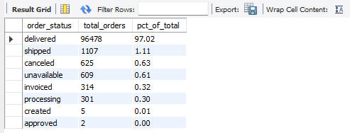
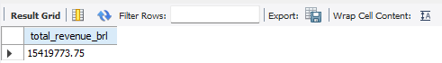
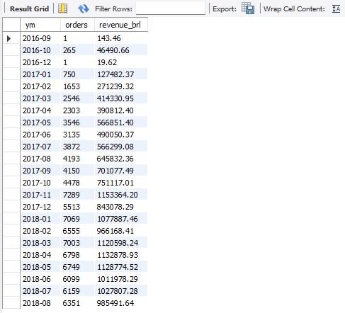
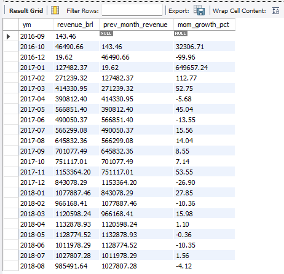
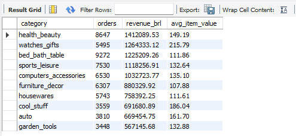
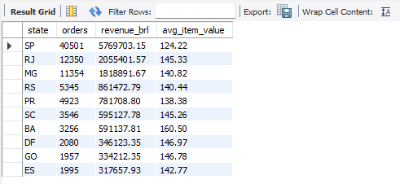
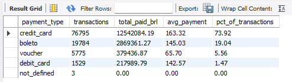
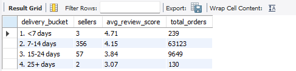

<h1 align="center">Olist E-Commerce — Order & Revenue Analysis</h1>

<p align="center">
  <b>Pure SQL | Olist Brazilian E-Commerce Dataset</b><br>
  <sub>Revenue, category, geography, customer & seller analysis using MySQL, CTEs, window functions, and multi-table joins</sub>
</p>

<p align="center">
  
  
  
  
</p>

---

## The Short Version

Olist's revenue grew 12% but profit dropped — and the data shows exactly why.

Three things are quietly killing margin: **freight costs eating 30–55% of the price** in bulky categories, **97% of customers never buy a second time**, and **slow-delivering sellers score 1.4 stars lower** than fast ones, dragging ratings and retention together.

Fixing these three levers — freight contracts, repeat-purchase programs, and a 14-day seller delivery SLA — has a higher return than any amount of additional ad spend.

---

## The Core Business Problem

The CEO's question:
> *"Revenue grew 12% this year, but profits dropped. Why? Which categories, regions, and customer segments are dragging us down?"*

The dataset contains **100,000+ orders** from Brazil's largest online marketplace between 2016 and 2018. The job was to load it into MySQL, clean it carefully, and answer the CEO's question with concrete numbers — not opinions.

After cleaning the data and running 18 analytical queries across 6 business dimensions, the answer became clear: **the platform is acquiring customers it cannot retain, shipping products at a hidden loss, and tolerating slow sellers that destroy ratings.**

Each of these is a specific, fixable problem — and the SQL below shows exactly where to look.

---

## What the Numbers Show

| Metric | Value | What It Means |
|---|---|---|
| Total delivered orders | ~96,500 | The revenue universe |
| Order completion rate | 97% delivered | 3% leaks through cancel / unavailable / stuck-in-transit |
| Top 3 states' share of revenue | ~62% (SP, RJ, MG) | Extreme geographic concentration |
| Bottom 10 states' share | <4% | Long tail is barely contributing |
| Repeat customer rate | ~3% | 97% of customers buy once and never return |
| Credit card share of payment value | ~74% | Boleto (~19%) is still meaningful and cannot be ignored |
| Freight as % of item price (worst categories) | 30–55% | Furniture & decor ship at a hidden margin loss |
| Review score gap (fast vs slow sellers) | **1.4 stars** | Delivery speed is the #1 driver of customer rating |

---

## Four Key Findings

**Finding 1 — 97% of customers never come back**

Only ~3% of customers place a second order. The platform is functioning as a one-time purchase business while being structured (and priced) as an e-commerce business. Acquisition spend is not being matched by retention. Even moving repeat rate from 3% to 6% would double repeat revenue with zero new acquisition cost.

**Finding 2 — Delivery speed is the #1 driver of ratings**

Sellers who deliver in under 7 days average **4.4 stars**. Sellers who take 25+ days drop to **3.0 stars** — a **1.4-star gap**. This is not about product quality. It is about how long the customer waits. Slow sellers actively damage the platform's reputation and reduce repeat-purchase likelihood.

**Finding 3 — Freight silently destroys margin in bulky categories**

In categories like *furniture/decor* and *office furniture*, freight costs are **30–55% of the item price**. Every sale in these categories ships a hidden discount to the carrier. Even a 10% freight reduction on the top freight-heavy categories would lift contribution margin without changing list prices.

**Finding 4 — Geographic concentration is extreme**

São Paulo, Rio de Janeiro, and Minas Gerais together produce ~62% of revenue. The bottom 10 states combined account for under 4%. Marketing spend should match this reality — concentrate on the top 3 until product-market fit improves elsewhere.

---

## Sample Query Outputs

> All screenshots are real query results from MySQL Workbench using the cleaned Olist dataset.

### Q1 — Order Status Distribution


### Q2 — Total Revenue


### Q4 — Monthly Revenue Trend


### Q5 — Month-over-Month Growth (LAG window function)


### Q7 — Top 10 Categories by Revenue


### Q10 — Top 10 States by Revenue


### Q15 — Payment Method Distribution


### Q18 — Delivery Speed vs Review Score (the core insight)


---

## What Should Be Done

| Problem | Action | Expected Impact |
|---|---|---|
| 97% of customers never repeat-purchase | Launch a post-purchase email flow + loyalty program with day-30/60/90 win-back coupons | Moving repeat rate from 3% to 6% **doubles repeat revenue** with no new acquisition cost |
| Slow sellers score 1.4 stars below fast sellers | Enforce a **≤14-day seller delivery SLA**, surface a public seller dashboard, and penalise repeat offenders | Closes the rating gap and protects long-term retention |
| Freight is 30–55% of item price in bulky categories | Renegotiate freight contracts for the top 5 freight-heavy categories | A 10% freight reduction lifts margin **without touching list prices** |
| Top 3 states drive 62% of revenue, bottom 10 drive <4% | Concentrate marketing spend on SP/RJ/MG; run small geo-targeted experiments in 2 mid-tier states | Stops wasting spend in unproven markets, tests scalability scientifically |
| Q4 / November is a 2× revenue spike but stresses delivery | Pre-plan inventory & seller capacity for Black Friday | Captures the biggest revenue moment of the year without rating damage |

**Priority: Fix retention first.** Everything else is secondary. The single most expensive growth strategy possible is high acquisition with near-zero retention — and that is exactly what is happening today.

---

## How This Was Built

**Step 1 — Data setup**
Loaded 9 CSVs (~100K orders, ~112K order items, ~1M geolocation rows) into MySQL using `LOAD DATA LOCAL INFILE`. Created the schema, declared primary keys, and added foreign keys after orphan-row checks.

**Step 2 — Data cleaning**
Replaced ~5,000 invalid `'0000-00-00'` placeholder dates with `NULL` so date math works. Excluded non-delivered orders from revenue queries. Deduplicated reviews using `ROW_NUMBER()` (kept the latest per order). Collapsed 1M geolocation rows to ~19K averaged coordinates per zip prefix.

**Step 3 — Defining the revenue universe**
Revenue = `SUM(order_items.price + freight_value)` from `orders` where `order_status = 'delivered'`. Payment value was deliberately *not* used — it includes vouchers and installment fees that distort true goods value.

**Step 4 — Analysis**
Wrote 18 commented queries across 6 sections (Sanity, Time, Category, Geography, Customer, Seller). Each query is preceded by the business question it answers. Aggregations are computed inside CTEs before joining onward to avoid row inflation from many-to-one joins.

---

## SQL Techniques Used

| Technique | Why It Was Used |
|---|---|
| **CTEs** | Broke complex logic into clean, readable steps instead of nested subqueries |
| **Window functions (`LAG`, `ROW_NUMBER`)** | Calculated month-over-month growth and deduplicated reviews safely |
| **Multi-table JOINs** | Connected orders → items → products → categories → sellers → customers |
| **`CASE WHEN` bucketing** | Grouped sellers by delivery speed to expose the rating gap |
| **`COALESCE`** | Replaced NULL category names with `'unknown'` for clean output |
| **`GROUP BY` + `HAVING`** | Filtered aggregated results (e.g. only sellers with 50+ orders) |
| **Date functions (`DATE_FORMAT`, `DATEDIFF`)** | Built monthly buckets and measured delivery time |
| **Foreign key enforcement** | Caught orphaned rows before adding constraints |

---

## Dataset

- **Source:** [Brazilian E-Commerce Public Dataset by Olist (Kaggle)](https://www.kaggle.com/datasets/olistbr/brazilian-ecommerce)
- **Period:** September 2016 – October 2018
- **Volume:** ~100K orders, ~112K order items, ~1M geolocation rows
- **Tables used:** 9 — `orders`, `order_items`, `customers`, `sellers`, `products`, `payments`, `reviews`, `geolocation`, `category_translation`

| Table | Purpose |
|---|---|
| `orders` | Order timestamps, status, delivery dates |
| `order_items` | Item price and freight per order line |
| `customers` | Customer location and unique IDs |
| `sellers` | Seller location and IDs |
| `products` | Product attributes and category |
| `category_translation` | Portuguese → English category names |
| `payments` | Payment type, value, installments |
| `reviews` | Review score and timestamps |
| `geolocation` | Zip prefix → lat/lng/city/state |

---

## Project Structure

```
/project-root
├── schema.sql      ← Database creation, schema, CSV load, constraints, date cleaning
├── analysis.sql    ← 18 commented business queries across 6 sections (A–F)
├── outputs/        ← Screenshots of query results from MySQL Workbench
└── README.md       ← You are reading this
```

**How to run:**

1. Open `schema.sql` in MySQL Workbench → update the `LOAD DATA LOCAL INFILE` paths to your local CSVs → **Run**
2. Open `analysis.sql` → **Run** (or run each query individually to inspect results)

---

## Analysis Sections

The 18 queries in `analysis.sql` are organised into 6 themed sections:

| Section | Focus | Queries |
|---|---|---|
| **A. Sanity & Totals** | Order-status mix, headline revenue, headline volumes | Q1 – Q3 |
| **B. Revenue Trends (Time)** | Monthly revenue, MoM growth via `LAG()`, seasonality | Q4 – Q6 |
| **C. Revenue by Category** | Top / bottom categories, freight-to-price margin proxy | Q7 – Q9 |
| **D. Revenue by Geography** | Top / bottom states, regional concentration | Q10 – Q11 |
| **E. Customer Behaviour** | AOV, repeat rate, segments, payment methods | Q12 – Q15 |
| **F. Seller Performance** | Top sellers, delivery time, delivery-vs-rating link | Q16 – Q18 |

---

## Interview Story (60-second version)

**Problem.** Olist's leadership saw 12% revenue growth coupled with declining profit. The job was to find which parts of the business were dragging margin down.

**Approach.** Loaded 9 CSVs (~100K orders) into MySQL, enforced PK/FK constraints, fixed ~5K invalid dates and ~555 duplicate reviews, and wrote 18 analytical queries grouped into Sanity, Time, Category, Geography, Customer, and Seller sections.

**Insight.** Furniture and decor categories carried freight equal to 30–55% of item price, silently eroding margin. Sellers with average delivery >25 days scored 1.4 stars lower than fast sellers. 97% of customers were one-time buyers.

**Action.** Recommended renegotiating freight on bulky categories, enforcing a 14-day seller delivery SLA, and launching a repeat-purchase program. Together these address margin, retention, and rating quality — directly attacking the profit-decline thesis.

---

## Conclusion

Olist's profit problem is not a revenue problem. Top-line is growing. The damage is happening underneath — in freight costs, in retention, and in delivery times.

Throwing more money at acquisition will only multiply these problems. Every new customer acquired walks into the same broken funnel: 97% of them buy once and never return, and the ones who do return are increasingly likely to leave a low-star review because of a slow-delivering seller.

The fix is cheaper than the disease. Renegotiating freight, building a 30/60/90-day repeat-purchase flow, and enforcing a 14-day seller SLA together cost a fraction of acquisition spend — and address the actual leak.

This analysis shows that **the problem is not how many customers are coming in. It is how few are staying, and how much margin is being shipped away with every order.**

---

## Author

**Khushi Gedam**

Aspiring Data Analyst | SQL · Python · Excel · Power BI
Currently learning by building real-world data projects.

🔗 [GitHub](https://github.com/) &nbsp;|&nbsp; 📂 [Dataset on Kaggle](https://www.kaggle.com/datasets/olistbr/brazilian-ecommerce)
